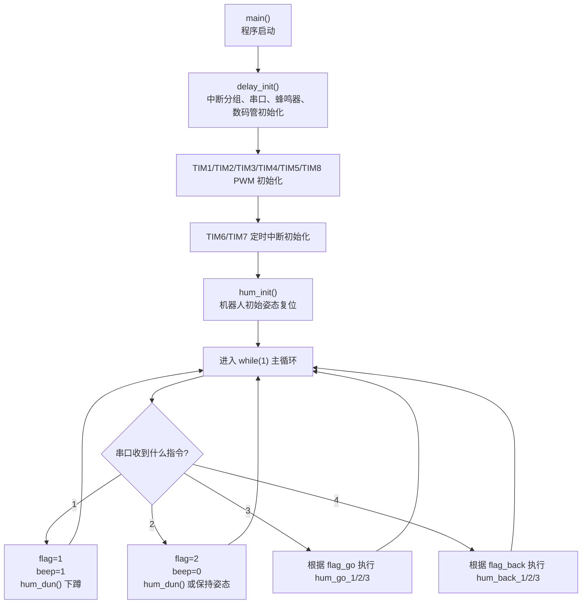
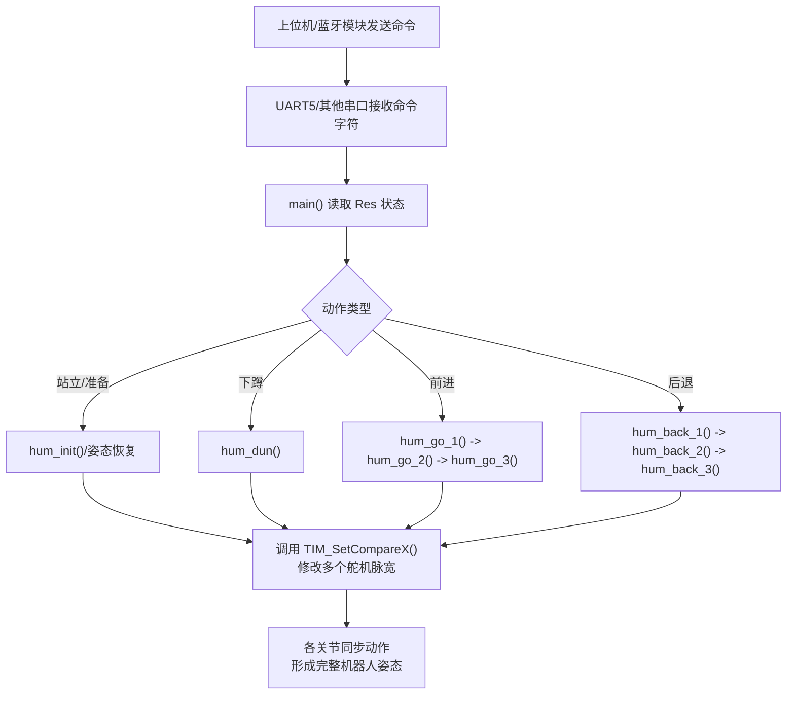

# ESP32 多舵机机器人控制详细流程图

对应工程：
- `2.3`

核心文件：
- 主程序入口：`2.3/USER/main.c`
- PWM 底层输出：`2.3/HARDWARE/PWM/pwm.c`
- 动作编排：`2.3/HARDWARE/hum/hum.c`
- 串口通信：`2.3/SYSTEM/usart/usart.c`
- 定时与节拍：`2.3/HARDWARE/time/tim.c`

## 1. 这是一个什么项目

这是一个基于 **STM32F103** 的 **多舵机机器人动作控制项目**。虽然仓库名叫 `Bi_she_esp32`，但从当前代码来看，仓库里实际保存的是一套以 **STM32 + 多路 PWM + 蓝牙串口指令** 为核心的人形机器人控制工程。

这套工程最重要的特点不是“控制一个舵机”，而是：

- 同时控制很多路舵机
- 把多路舵机组合成一个完整动作
- 通过串口或蓝牙发送指令
- 让机器人执行站立、下蹲、前进、后退等预设动作

从 `hum.c` 的舵机编号和动作函数可以看出来，这个项目更接近一个 **多自由度人形机器人/仿生机器人** 的控制程序。

## 2. 项目整体主流程

## 3. 动作执行流程

## 4. 多舵机控制是怎么做的

从 `pwm.c` 和 `hum.c` 可以看出，这个项目不是用单个定时器控制单个舵机，而是：

- 开启多个定时器：`TIM1`、`TIM2`、`TIM3`、`TIM4`、`TIM5`、`TIM8`
- 每个定时器提供多个 PWM 通道
- 每个通道对应一个关节舵机
- 通过 `TIM_SetCompareX()` 修改脉宽
- 把多个关节脉宽组合成一个动作姿态

可以把它理解成下面这个逻辑：

`一个动作 = 多个舵机角度同时改动`

所以仓库里最核心的不是某一个 PWM 函数，而是 `hum.c` 里把很多舵机位置组合起来形成动作序列的方式。

## 5. 主要模块分别做什么

| 模块 | 代表文件 | 作用 |
| --- | --- | --- |
| 主循环调度 | `2.3/USER/main.c` | 完成初始化、接收命令、决定当前执行哪个动作。 |
| PWM 驱动 | `2.3/HARDWARE/PWM/pwm.c` | 初始化多个定时器 PWM 通道，为舵机输出脉宽。 |
| 动作库 | `2.3/HARDWARE/hum/hum.c` | 定义机器人初始化、下蹲、前进、后退等一组组关节动作。 |
| 串口通信 | `2.3/SYSTEM/usart/usart.c` | 负责和蓝牙或上位机通信，把指令送给主程序。 |
| 节拍定时 | `2.3/HARDWARE/time/tim.c` | 提供动作切换和周期执行所需的时间基础。 |

## 6. 关键函数怎么理解

| 函数名 | 作用 |
| --- | --- |
| `hum_init()` | 让机器人进入一个初始站姿，相当于“上电后先摆正身体”。 |
| `hum_dun()` | 执行下蹲姿态。 |
| `hum_go_1()` / `hum_go_2()` / `hum_go_3()` | 把前进一步拆成 3 个连续阶段，便于动作平滑。 |
| `hum_back_1()` / `hum_back_2()` / `hum_back_3()` | 把后退一步拆成 3 个连续阶段。 |
| `TIMx_PWM_Init()` | 初始化不同定时器的 PWM 通道。 |
| `TIM_SetCompareX()` | 真正改变某一路舵机脉宽，也就是改变关节角度。 |

## 7. 小白怎么读这个项目

建议按这个顺序看：

1. 先看 `2.3/USER/main.c`，理解外部命令是怎么触发动作的。
2. 再看 `2.3/HARDWARE/hum/hum.c`，理解每个动作对应哪些舵机变化。
3. 然后看 `2.3/HARDWARE/PWM/pwm.c`，理解底层 PWM 是怎么输出到各个通道的。
4. 最后看 `2.3/SYSTEM/usart/usart.c`，理解蓝牙或串口命令是怎么进入系统的。

如果你只想先抓住核心，就先记住一句话：

`这个仓库本质上是在做“通过串口命令驱动多路舵机，让机器人完成预设动作”。`

## 8. 这个项目实现了什么

从现有代码能明确看出的功能包括：

- 多定时器多通道 PWM 输出
- 多舵机关节同步控制
- 机器人初始姿态设置
- 下蹲动作
- 前进动作分阶段执行
- 后退动作分阶段执行
- 蓝牙/串口命令控制机器人动作

因此它比较适合这些场景：

- 毕业设计
- 多舵机机器人控制
- 人形机器人动作编排
- 仿生机构控制
- 蓝牙控制机器人
- 嵌入式多通道 PWM 学习

## 9. 相关技术关键词

- STM32 多舵机控制
- 机器人关节控制
- 多通道 PWM 输出
- 人形机器人控制
- 蓝牙控制机器人
- 舵机动作编排
- 机器人步态控制
- 毕设机器人项目
